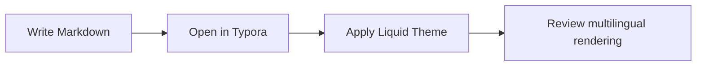
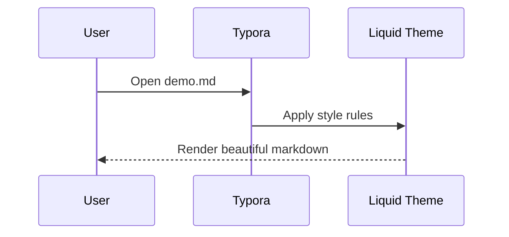

# Liquid Theme · Typora Complete Demo

[TOC]

> A comprehensive Typora feature showcase in six languages:
> **English • 中文 • Deutsch • Español • Français • 日本語**

---

## 1. Introduction / 介绍 / Einführung / Introducción / Introduction / はじめに

### English
This document demonstrates common and advanced Markdown features rendered by Typora with the Liquid theme.

### 中文
本文档用于演示 Typora 在 Liquid 主题下对常见与高级 Markdown 功能的渲染效果。

### Deutsch
Dieses Dokument zeigt gängige und erweiterte Markdown-Funktionen, wie sie in Typora mit dem Liquid-Theme dargestellt werden.

### Español
Este documento muestra funciones comunes y avanzadas de Markdown renderizadas por Typora con el tema Liquid.

### Français
Ce document présente les fonctionnalités Markdown courantes et avancées, rendues dans Typora avec le thème Liquid.

### 日本語
このドキュメントは、Liquid テーマを適用した Typora で表示される、一般的および高度な Markdown 機能を紹介します。

---

## 2. Typography / 排版 / Typografie / Tipografía / Typographie / タイポグラフィ

### Emphasis

- **Bold / 粗体 / Fett / Negrita / Gras / 太字**
- *Italic / 斜体 / Kursiv / Cursiva / Italique / 斜体*
- ***Bold + Italic / 粗斜体 / Fett + Kursiv / Negrita + Cursiva / Gras + Italique / 太字+斜体***
- ==Highlight / 高亮 / Hervorhebung / Resaltado / Surlignage / ハイライト==
- ~~Strikethrough / 删除线 / Durchgestrichen / Tachado / Barré / 取り消し線~~
- <u>Underline / 下划线 / Unterstrichen / Subrayado / Souligné / 下線</u>

### Abbreviation and keyboard style

Use <abbr title="Application Programming Interface">API</abbr> keys like <kbd>Ctrl</kbd> + <kbd>S</kbd> to save.

### Horizontal rule

---

## 3. Quotes / 引用 / Zitate / Citas / Citations / 引用

> “Design is intelligence made visible.”
>
> - English: Keep interfaces readable.
> - 中文：保持界面清晰易读。
> - Deutsch: Halte Oberflächen gut lesbar.
> - Español: Mantén la interfaz legible.
> - Français : Gardez l’interface lisible.
> - 日本語：読みやすいインターフェースを保ちましょう。

---

## 4. Lists / 列表 / Listen / Listas / Listes / リスト

### Task list

- [x] Install Liquid theme
- [x] Open this file in Typora
- [ ] Customize fonts and spacing

### Ordered list

1. Start Typora.
2. Select **Theme → Liquid**.
3. Compare each language section.

### Nested unordered list

- Fruits
  - Apple
  - Orange
- Languages
  - English
  - 中文
  - Deutsch
  - Español
  - Français
  - 日本語

---

## 5. Links and Footnotes / 链接与脚注 / Links und Fußnoten / Enlaces y notas / Liens et notes / リンクと脚注

- Project homepage: [Liquid Theme](https://github.com/ruiyangzhou01/Liquid)
- Latest release: [Releases](https://github.com/ruiyangzhou01/Liquid/releases)

This sentence includes a footnote.[^demo-note]

[^demo-note]: Typora can render inline references and footnotes elegantly.

---

## 6. Tables / 表格 / Tabellen / Tablas / Tableaux / 表

| Language | Greeting | Sample sentence |
| :-- | :--: | --: |
| English | Hello | The quick brown fox jumps over the lazy dog. |
| 中文 | 你好 | 快速的棕色狐狸跳过了那只懒狗。 |
| Deutsch | Hallo | Franz jagt im komplett verwahrlosten Taxi quer durch Bayern. |
| Español | Hola | El veloz murciélago hindú comía feliz cardillo y kiwi. |
| Français | Bonjour | Portez ce vieux whisky au juge blond qui fume. |
| 日本語 | こんにちは | いろはにほへと ちりぬるを。 |

---

## 7. Code / 代码 / Code / Código / Code / コード

### Inline code

Use `git status` before `git commit`.

### Fenced blocks (multiple languages)

```bash
# Shell
npm install
npm run dev
```

```python
# Python
def greet(name: str) -> str:
    return f"Hello, {name}!"
```

```javascript
// JavaScript
const languages = ["English", "中文", "Deutsch", "Español", "Français", "日本語"];
console.log(languages.join(" • "));
```

```html
<!-- HTML -->
<section class="hero">
  <h1>Liquid Typora Demo</h1>
  <p>Elegant markdown rendering.</p>
</section>
```

---

## 8. Math / 数学 / Mathematik / Matemáticas / Mathématiques / 数式

Enable **Markdown Extended Syntax** in Typora settings for best rendering.

### Block formula

$$
\Delta = b^2 - 4ac
$$

$$
\int_0^{2\pi} \sin(x)\,dx = 0
$$

### Inline formula

Quadratic roots: $x=\frac{-b\pm\sqrt{b^2-4ac}}{2a}$.

Chemistry notation: H~2~O and CO~2~.

Superscript examples: E=mc^2^.

---

## 9. Diagrams / 图表 / Diagramme / Diagramas / Diagrammes / 図

### Mermaid flowchart



### Mermaid sequence



---

## 10. Media / 媒体 / Medien / Medios / Médias / メディア

### Image


### Block emoji and symbols

- ✅ Success
- ⚠️ Warning
- ❌ Error
- 💧 Liquid

---

## 11. Advanced blocks / 高级块 / Erweiterte Blöcke / Bloques avanzados / Blocs avancés / 高度なブロック

### Collapsible details (HTML)

<details>
<summary>Click to expand / 点击展开 / Zum Aufklappen klicken / Haz clic para expandir / Cliquez pour ouvrir / クリックして展開</summary>

- English: Hidden notes can improve readability.
- 中文：隐藏内容可以提升文档可读性。
- Deutsch: Versteckte Inhalte verbessern die Lesbarkeit.
- Español: El contenido oculto mejora la legibilidad.
- Français : Le contenu masqué améliore la lisibilité.
- 日本語：折りたたみ要素は可読性を高めます。

</details>

### Definition-style list (simulated)

- **Liquid Theme**: A clean and modern Typora theme.
- **Typora**: A live preview Markdown editor.
- **Markdown**: Lightweight markup language.

---

## 12. Final checklist / 最终检查 / Abschlusscheck / Lista final / Vérification finale / 最終チェック

- [x] Headings
- [x] Text emphasis
- [x] Quotes
- [x] Lists
- [x] Links and footnotes
- [x] Tables
- [x] Code blocks
- [x] Math formulas
- [x] Mermaid diagrams
- [x] Image and emoji
- [x] Multilingual content (EN / 中文 / DE / ES / FR / JA)

> If everything above renders nicely, your Liquid theme setup is working great.
